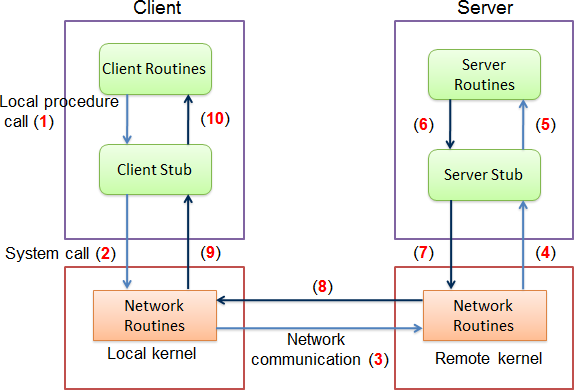
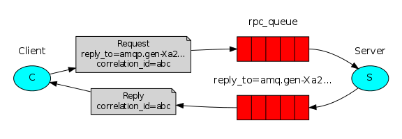

# Remote procedure call (RPC) using php-amqplib and Rabbit MQ

Remote Procedure Call (RPC) is a design paradigm that allow two entities to communicate over a communication channel in a general request-response mechanism.

Simplest RPC implementation looks like Figure 1. In this case, the client (or caller) and the server (or callee) are separated by a physical network. The main components of the system are the client routine/program, the client stub, the server routine/program, the server stub, and the network routines. 

RabbitMQ to build an RPC system: a client and a scalable RPC server. RPC client sends an RPC request to RPC Server and blocks until the answer is received:

RPC will work like this:

 - When the Client starts up, it creates an anonymous exclusive callback queue.
 - For an RPC request, the Client sends a message with two properties: reply_to, which is set to the callback queue and correlation_id, which is set to a unique value for every request.
 - The request is sent to an rpc_queue queue.
 - The RPC worker (aka: server) is waiting for requests on that queue. When a request appears, it does the job and sends a message with the result back to the Client, using the queue from the reply_to field.
 - The client waits for data on the callback queue. When a message appears, it checks the correlation_id property. If it matches the value from the request it returns the response to the application.
 - As usual we start by establishing the connection, channel and declaring the queue.
 - We might want to run more than one server process. In order to spread the load equally over multiple servers we need to set the prefetch_count setting in $channel.basic_qos.
 - We use basic_consume to access the queue. Then we enter the while loop in which we wait for request messages, do the work and send the response back.

##Install

###Warning:

This package doesn't try to solve more complex (but important) problems, like:
 1) How should the client react if there are no servers running?
 2) Should a client have some kind of timeout for the RPC?
 3) If the server malfunctions and raises an exception, should it be forwarded to the client?
 4) Protecting against invalid incoming messages (eg checking bounds, type) before processing.

Although RPC is a pretty common pattern in computing, it's often criticised. The problems arise when a programmer is not aware whether a function call is local or if it's a slow RPC. Confusions like that result in an unpredictable system and adds unnecessary complexity to debugging. Instead of simplifying software, misused RPC can result in unmaintainable spaghetti code.

Bearing that in mind, consider the following advice:

1) Make sure it's obvious which function call is local and which is remote.
2) Document your system. Make the dependencies between components clear.
3) Handle error cases. How should the client react when the RPC server is down for a long time?
4) When in doubt avoid RPC. If you can, you should use an asynchronous pipeline - instead of RPC-like blocking, results are asynchronously pushed to a next computation stage.

[Full example](https://www.rabbitmq.com/tutorials/tutorial-six-php.html)

## Swagger ##

[localhost:8081/docs/index.html](http://localhost:8081/docs/index.html)